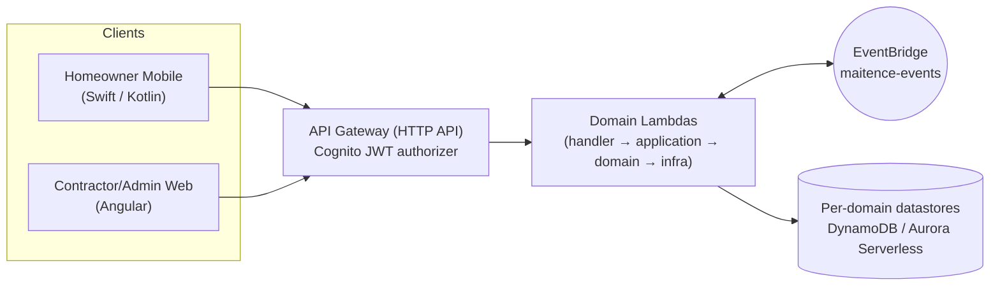
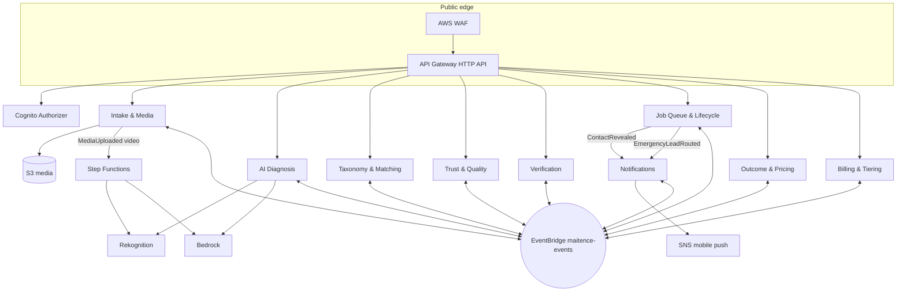
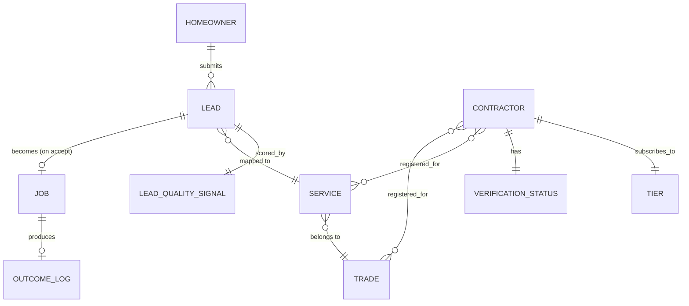

# Architecture Spine — AI-Powered Lead Intake Platform (maitence-app)

## Design Paradigm

**Event-driven serverless architecture, domain-bounded Lambda services.** The product is decomposed into ten bounded contexts (below), each owning its own data and each internally shaped hexagonal: `handler` (API Gateway/EventBridge adapter) → `application` (use-case orchestration) → `domain` (business rules, no AWS SDK imports) → `infra` (DynamoDB/Aurora/S3/Bedrock/EventBridge adapters). Contexts integrate two ways only: publish/subscribe over a shared EventBridge bus (default, eventually consistent), or a narrow synchronous internal call for the rare case that needs immediate consistency (e.g. Matching checking live Verification status). No context ever reads another's table directly.



## Invariants & Rules

### AD-1 — Bounded contexts and data ownership

- **Binds:** all
- **Prevents:** two domains independently building a shared "Lead" or "Contractor" table and drifting on shape/ownership.
- **Rule:** exactly ten bounded contexts exist — **Identity**, **Intake & Media**, **AI Diagnosis**, **Taxonomy & Matching**, **Trust & Quality**, **Verification**, **Job Queue & Lifecycle**, **Outcome & Pricing**, **Billing & Tiering**, **Notifications**. Each owns exactly one set of datastores; no other context is ever granted read or write IAM access to it. Cross-context reads happen only via consumed events or the internal sync API (AD-3).

### AD-2 — Logical boundary is decoupled from physical deployment

- **Binds:** all
- **Prevents:** forcing a ten-microservice ops burden on day one, or conversely collapsing contexts into a shared table because "it's simpler for now."
- **Rule:** the ten contexts above are data-ownership and contract boundaries, not a mandate for ten physical Lambda stacks. Multiple contexts may be co-deployed behind fewer CDK stacks/Lambda functions early on — but each context's table(s), API routes, and published event shapes stay exactly as fixed here regardless of how many physical stacks realize them. Splitting a stack later must never change a route or event shape.

### AD-3 — Single API Gateway, domain-routed

- **Binds:** all client-facing FRs (FR-1–FR-19)
- **Prevents:** mobile and web ending up on divergent auth, rate-limiting, or observability setups because each grew its own gateway.
- **Rule:** one API Gateway (HTTP API) fronts every domain, route-grouped by context (`/leads`, `/diagnosis`, `/contractors`, `/queue`, `/verification`, `/tiers`, `/outcomes`, `/media`). Cognito JWT authorizer on every authenticated route. The rare cross-domain synchronous call (AD-1) is a direct Lambda-to-Lambda invoke or an internal-only API Gateway route, never exposed on the public gateway.

### AD-4 — Cross-domain integration: events by default

- **Binds:** all
- **Prevents:** a domain quietly depending on another domain's internals for immediate consistency it doesn't actually need, recreating a distributed monolith.
- **Rule:** default integration is publish/subscribe on the `maitence-events` EventBridge bus (eventually consistent). A synchronous internal call is permitted only when the caller cannot proceed without an immediate, current answer (e.g. Matching confirming a Contractor is still Verified before final routing) — and even then it is a narrow, versioned internal API, not a table read. EventBridge is at-least-once and unordered: every consumer is idempotent, deduplicating on `eventId` (a conditional write / seen-id table, not "assume single delivery"), and no consumer ever infers state from event arrival order — it reads current authoritative state via the publishing domain's event payload or a sync call instead of sequencing its own logic on delivery order.

### AD-5 — Datastore split: DynamoDB vs. Aurora Serverless

- **Binds:** all ten contexts, explicitly — Intake & Media, Job Queue & Lifecycle, Verification, Outcome & Pricing, Notifications, AI Diagnosis, Trust & Quality (DynamoDB) · Taxonomy & Matching, Billing & Tiering (Aurora Serverless PostgreSQL) · Identity (Cognito's own managed store, neither of the above — see AD-9).
- **Prevents:** one team defaulting every domain to relational joins (defeating the Lambda-native access-pattern fit) while another denormalizes a genuinely relational, join-heavy dataset into unreadable DynamoDB item duplication — and, specifically, two domains disagreeing on who owns a shared reference dataset because it wasn't assigned.
- **Rule:** high-write, single-entity-keyed, access-pattern-known domains (Lead, Job, Verification status, Outcome, Notification, AI Diagnosis records, Lead-Quality-Signal records) use DynamoDB, single table per domain, GSIs for the domain's known query patterns (e.g. queue-by-contractor-then-emergency-first). The Taxonomy (Trades/Services/ContractorTrades/ContractorServices — inherently the relational shape in `addendum.md`) and Billing/Tiering (subscription state, seat entitlements) use Aurora Serverless PostgreSQL, because their read patterns are join-heavy and volume is comparatively small. Service-level market-rate reference data (consumed by FR-9's Budget-Realism Check) is owned by Taxonomy & Matching alongside the Service catalog it's naturally keyed to — Trust & Quality never stores its own copy; it reads it via the internal sync-call exception in AD-4 or a read-through cache it invalidates on `TradeCatalogUpdated`-class events, never a second source of truth.

### AD-6 — AI Diagnosis: sync photo path, async video path

- **Binds:** FR-1, FR-3, FR-4
- **Prevents:** video processing blocking the "no perceptible wait" photo-diagnosis promise (FR-1 NFR), and ad-hoc retry logic re-implemented per Lambda in the multi-step AI call chain.
- **Rule:** photo+description diagnosis is a direct synchronous chain (API Gateway → Lambda → Rekognition → Bedrock → persist → respond). Video is always async: a `MediaUploaded(video)` event starts a Step Functions Standard workflow (Rekognition → Bedrock → persist → publish `AIDiagnosisEnriched`), with retry/backoff native to the state machine. The synchronous path never waits on the workflow. Whether Bedrock consumes the video via extracted frames or a native video-input model (e.g. Nova-class models now accept video directly — verified 2026-07-14, this is no longer frame-extraction-only) is an AI Diagnosis-internal implementation choice, not fixed here (see Deferred); either way the workflow shape and event contract in this AD hold.

### AD-7 — Anonymous homeowner session, promoted at booking

- **Binds:** FR-1, FR-2 (UJ-1 unauthenticated entry)
- **Prevents:** an unauthenticated homeowner session being able to read or write any Lead other than the one it created, and a partial-failure state where identity promotion succeeds but contact capture doesn't (or vice versa) silently reopening the anonymous-access hole this AD exists to close.
- **Rule:** Intake & Media issues a short-lived (24-hour, single-use-exchange) signed session token scoped to exactly one draft Lead id on first app open, pre-account. No endpoint accepts an anonymous token against any Lead id other than the one it was scoped to. Intake & Media owns the Booking Confirmation step outright — a literal cross-domain database transaction with Identity is architecturally impossible under AD-1, so the sequence is instead: Intake & Media synchronously calls Identity's internal promote-session API (AD-4's sync exception) first; only if that call succeeds does Intake & Media commit the Lead write with contact info attached; if promotion fails, the Lead write does not happen and the homeowner sees a retry, not a half-booked Lead. Contact info itself still lands behind AD-8's isolation the moment it's captured.

### AD-8 — Contact info isolation (Contact-Reveal enforcement)

- **Binds:** FR-13
- **Prevents:** any Contractor-facing read model or endpoint leaking a Homeowner's contact info before a Contact-Reveal Event has fired — the exact trust boundary FR-13 depends on.
- **Rule:** contact fields (phone/email/address) live in a physically separate, separately-encrypted attribute-set from the rest of the Lead/Job record, and are never present in any Contractor-facing projection until unlocked. The Lead-acceptance Lambda is the *only* write path permitted to copy those fields into the Contractor-visible projection, and it does so in the same transaction that emits `ContactRevealed` — never as two separable steps. This isolation extends to logging: no Lambda ever writes a contact field, a raw media URL, or unredacted diagnosis free-text into a CloudWatch log line (see Consistency Conventions) — a correct data-layer isolation that leaks through structured logs still counts as a violation of this AD.

### AD-9 — Cognito: two pools, not one

- **Binds:** Identity, all authenticated routes
- **Prevents:** Contractor/Admin's stricter trust requirements (MFA, seat-based multi-user, business account) leaking into or being diluted by the deliberately lightweight Homeowner auth flow, or vice versa.
- **Rule:** Homeowner Pool (mobile, lightweight, optional social login, no MFA requirement) and Contractor/Admin Pool (web, MFA required, seat/Tier-aware) are separate Cognito User Pools with separate app clients. No shared pool, no shared group-based trick to fake the separation.

### AD-10 — IAM and KMS: least privilege, per-domain keys

- **Binds:** all
- **Prevents:** a single broad Lambda execution role becoming the de facto admin credential a compromised function can pivot from.
- **Rule:** one IAM execution role per Lambda function, scoped by resource ARN to only what that function calls. One customer-managed KMS key (CMK) per domain's datastore — never the AWS-managed default key — so key policy and rotation are independently auditable per domain.

### AD-11 — Untrusted media never reaches the AI pipeline unscanned or unmoderated

- **Binds:** FR-1, FR-3, FR-4
- **Prevents:** attacker-controlled uploaded media reaching Rekognition/Bedrock or long-term storage before any validation, and an anonymous, pre-auth uploader (AD-7) using the presigned-upload path to flood storage/AI spend or plant illegal/abusive content.
- **Rule:** clients never upload directly to a Lambda; they receive a short-expiry, key-prefix-scoped presigned S3 PUT URL from Intake & Media, rate-limited per anonymous session token and per device/IP (a fixed cap on Leads-created and bytes-uploaded per rolling window, enforced in the Intake Lambda itself, not only at the WAF). An S3 `ObjectCreated` event triggers both a malware/AV scan and a content-moderation scan (e.g. Rekognition content moderation labels); the object is not eligible for Rekognition/Bedrock diagnostic use or Job Queue display until both pass, and a failure routes to a quarantine state rather than silent deletion or silent pass-through.

### AD-12 — Edge and account-level security baseline

- **Binds:** all
- **Prevents:** treating perimeter/account monitoring as an opt-in add-on discovered only after an incident.
- **Rule:** AWS WAF sits on the API Gateway (rate-based rules + managed core rule set) — mandatory given Homeowner intake routes are public-reachable pre-auth. CloudTrail (org trail, data events enabled specifically on contact-info and verification tables), GuardDuty, and Security Hub are baseline account configuration, not per-feature decisions.

### AD-13 — IaC: AWS CDK (TypeScript)

- **Binds:** all
- **Prevents:** infra-as-code drifting into a second language/toolchain the TypeScript backend team doesn't already read.
- **Rule:** all infrastructure is defined in AWS CDK v2 (TypeScript). No CloudFormation-by-hand, no parallel Terraform stack.

### AD-14 — Every event has an owned, versioned schema

- **Binds:** all (event catalog)
- **Prevents:** a publisher and a consumer of the same event independently guessing `detail{}`'s shape and silently disagreeing (e.g. one side assumes `AIDiagnosisCompleted.detail` carries the full diagnosis text, the other assumes only a lookup id) — the envelope convention fixes the wrapper, not the payload.
- **Rule:** every event type in the event catalog has a single owning domain (always the publisher) that defines and versions its `detail{}` shape as a checked-in JSON Schema (or shared TypeScript/Python type), published where every consumer imports it — never hand-copied. A consumer never infers a field's presence from a different event; if it needs data the schema doesn't carry, that's a schema gap to fix at the source, not a workaround downstream.

### AD-15 — Job completion: one state owner, outcome-gated

- **Binds:** FR-13, FR-15
- **Prevents:** Job Queue & Lifecycle and Outcome & Pricing each independently assuming they close the Job — one flipping `status=Completed` the instant a Contractor taps "done," the other only firing its own completion fact once an outcome form is submitted, leaving jobs stuck "Completed" in the dashboard with no outcome ever logged (silently starving FR-15/SM-8).
- **Rule:** Job Queue & Lifecycle is the sole owner of the Job state machine, including its terminal `Completed` state. A Contractor's "mark complete" tap publishes `JobMarkedComplete` (Job Queue & Lifecycle → Outcome & Pricing), not a state change yet. Outcome & Pricing prompts for and captures the outcome, then publishes `OutcomeLogged`. Only on consuming `OutcomeLogged` does Job Queue & Lifecycle transition the Job to `Completed` — modeling FR-15's "prompts for actual final cost before being marked closed" without two domains racing to own the same transition.

### AD-16 — Backup baseline

- **Binds:** all
- **Prevents:** a domain's datastore going live without point-in-time recovery simply because no one decided it was someone's job.
- **Rule:** every DynamoDB table has point-in-time recovery (PITR) enabled by default in its CDK construct; Aurora Serverless has automated backups with a minimum 7-day retention. This is a floor, not a DR runbook — numeric RPO/RTO targets and a tested restore procedure are Deferred.

## Consistency Conventions

| Concern | Convention |
| --- | --- |
| Entity ids | ULIDs, type-prefixed (`lead_01J…`, `job_01J…`, `ctr_01J…`) — k-sortable by creation time, which DynamoDB sort keys lean on directly for recency ordering (e.g. Job Queue, Emergency-first). |
| Dates | ISO-8601, UTC, always. |
| Error envelope | Every API Gateway integration returns `{ error: { code, message, requestId } }` on non-2xx; no domain invents its own shape. |
| Event envelope | Every EventBridge event: `{ eventId, eventType, occurredAt, source, correlationId, version, detail{} }`. `eventType` is PascalCase past-tense (`LeadAccepted`, `ContactRevealed`). A breaking change to `detail{}` bumps `version`; it is never mutated silently. |
| State & mutation | Each domain's DynamoDB table (or Aurora schema) is written only by that domain's own Lambdas — see AD-1/AD-4. |
| Logging & tracing | Structured JSON logs to CloudWatch, `correlationId` on every line; X-Ray enabled on every Lambda and the API Gateway stage (load-bearing given cross-domain event fan-out). Contact fields, raw media URLs, and diagnosis free-text are never written to a log line in plaintext — truncate/redact before logging (enforces AD-8 at the logging layer). |
| Config & secrets | Non-secret config via SSM Parameter Store; API keys/DB credentials via Secrets Manager, rotated on a fixed cadence (no permanent unrotated credential). Never a secret in a plaintext Lambda env var. |
| Auth | Cognito JWT on the API Gateway authorizer; see AD-9 for pool split, AD-7 for the anonymous-session exception. |
| Input validation | Every handler validates its request against a checked-in JSON Schema before any domain logic runs — malformed input never reaches business logic to reject on its own terms. |
| Resource naming/tagging | Every AWS resource tagged `{Environment, BoundedContext, CostCenter}` from the first CDK stack onward — this is what keeps the Deferred multi-account split (below) a later *move*, not a later *rewrite*. |

## Stack

| Name | Version |
| --- | --- |
| AWS CDK (IaC) | 2.261.x |
| Lambda runtime — TypeScript domains | nodejs24.x (active LTS; supersedes nodejs22.x, now maintenance-only) |
| Lambda runtime — AI domains | python3.14 (current LTS release, supersedes python3.13) |
| Aurora Serverless (PostgreSQL-compatible) | PostgreSQL 17.7, platform version 4 |
| DynamoDB | on-demand capacity mode (per-domain tables), PITR enabled (AD-16) |
| Mobile | Swift (iOS), Kotlin (Android) — native, per PRD addendum |
| Web dashboard | Angular — per PRD addendum |
| AI services | Amazon Rekognition, Amazon Bedrock (Nova-class models support native video input directly; frame-extraction is an alternative, not the only path), Amazon Textract/Transcribe (as needed) |
| Auth | Amazon Cognito (two User Pools, AD-9) |
| Messaging | Amazon EventBridge (`maitence-events` bus), AWS Step Functions (Standard, video pipeline) |
| Storage | Amazon S3 (media), presigned URLs |

*All versions above web-verified current as of 2026-07-14 (aws-cdk-lib 2.261.0 released 2026-07-02; Aurora Serverless v2 renamed "Aurora serverless" April 2026; Bedrock native-video support confirmed current).*

## Structural Seed



**Core entities (names + ownership only — attributes are code's to own):**



**Event catalog (published on `maitence-events`, by owning domain):**

| Event | Published by | Consumed by |
| --- | --- | --- |
| `LeadDraftCreated` | Intake & Media | Trust & Quality |
| `MediaUploaded` (photo \| video) | Intake & Media | AI Diagnosis |
| `AIDiagnosisCompleted` / `ConditionAssessmentCompleted` / `SpaceVisualizationCompleted` | AI Diagnosis | Taxonomy & Matching, Job Queue & Lifecycle |
| `AIDiagnosisEnriched` (video, async) | AI Diagnosis | Job Queue & Lifecycle |
| `IssueMappedToService` / `ServiceMappingFallback` | Taxonomy & Matching | Trust & Quality, Job Queue & Lifecycle |
| `LeadQualityScored` / `LeadFlaggedCold` | Trust & Quality | Job Queue & Lifecycle |
| `ContractorMatchSelected` | Taxonomy & Matching | Job Queue & Lifecycle |
| `EmergencyLeadRouted` | Job Queue & Lifecycle | Notifications |
| `LeadAccepted` | Job Queue & Lifecycle | Outcome & Pricing |
| `ContactRevealed` | Job Queue & Lifecycle | Notifications, Outcome & Pricing |
| `JobMarkedComplete` | Job Queue & Lifecycle | Outcome & Pricing |
| `OutcomeLogged` | Outcome & Pricing | Job Queue & Lifecycle (finalizes `Completed` per AD-15), (future) Estimate Refinement |
| `ContractorVerified` / `ContractorVerificationRejected` | Verification | Taxonomy & Matching, Notifications |
| `TierChanged` | Billing & Tiering | Taxonomy & Matching (Matching Priority weight) |

Every event above carries a versioned, owner-defined `detail{}` schema per AD-14 — the table names the event and its owner, not its payload shape.

```text
/services/
  identity/                    # Cognito-adjacent Lambdas: token exchange, session promotion (AD-7)
  intake-media/                # Guided Assessment, Skip-AI, Quick Submit, S3 presign, malware-scan hook
  ai-diagnosis/                # Rekognition/Bedrock orchestration, sync + Step Functions async (AD-6)
  taxonomy-matching/           # Issue-to-Service mapping, Contractor eligibility + ranking (Aurora)
  trust-quality/               # Lead-Quality Signal, Cold-Lead filtering
  verification/                # Contractor legitimacy/licensing gate
  job-queue-lifecycle/         # Lead->Job state machine, dashboard read model, Contact-Reveal (AD-8)
  outcome-pricing/             # Outcome Log capture, (post-MVP) estimate refinement
  billing-tiering/             # Subscription/Tier state, Admin seats (Aurora)
  notifications/               # SNS push, EventBridge-triggered
infra/
  cdk/                         # AD-13: all stacks, one per bounded context per AD-2
```

## Capability → Architecture Map

| Capability / Area | Lives in | Governed by |
| --- | --- | --- |
| FR-1, FR-2 (Hybrid Intake) | Intake & Media | AD-6, AD-7, AD-11 |
| FR-3, FR-4 (Condition Assessment, Space Visualization) | AI Diagnosis | AD-6 |
| FR-5, FR-6 (Issue-to-Service Matching) | Taxonomy & Matching | AD-4, AD-5 |
| FR-7–FR-10 (Lead Quality & Trust) | Trust & Quality | AD-4 |
| FR-11 (Verification Gate) | Verification | AD-1, AD-4 |
| FR-12–FR-14 (Job Queue Dashboard) | Job Queue & Lifecycle | AD-1, AD-8 |
| FR-15, FR-16 (Outcome Log, Pricing) | Outcome & Pricing | AD-5, AD-15 |
| FR-17, FR-18 (Tiering) | Billing & Tiering | AD-5 |
| FR-19 (Analytics, post-MVP) | Job Queue & Lifecycle (read model extension) | AD-1 |
| Auth (all) | Identity | AD-7, AD-9 |
| Push alerts | Notifications | AD-4 (event-triggered) |

## Deferred

- **Issue-to-Service mapping algorithm** (rules-based vs. model-driven, PRD Open Question 9) — Taxonomy & Matching's internal logic is unfixed; only its data ownership (Aurora) and event contract are fixed here.
- **Numeric AI Diagnosis latency/accuracy targets** (PRD SM-7/SM-8, Open Question 2) — Lambda memory/timeout tuning and any provisioned-concurrency decision for the synchronous diagnosis path wait on these.
- **Frame-extraction vs. native-video-model choice for Bedrock** (AD-6) — Nova-class native video input is now available alongside the original frame-extraction approach; AI Diagnosis's own build evaluates which fits, the workflow shape doesn't change either way.
- **Billing processor** — Stripe assumed `[ASSUMPTION]`; Billing & Tiering wraps it behind an internal interface so the vendor stays swappable without touching other domains.
- **AWS account topology** — multi-account (dev/staging/prod via AWS Organizations) is the target for blast-radius isolation; a lean early team may start single-account with strict IAM boundaries and split later, relying on the resource tagging convention (Consistency Conventions) already being in place.
- **CI/CD pipeline shape** — not fixed here; any pipeline must deploy per-context CDK stacks independently (per AD-2) rather than one monolithic deploy. Dependency/supply-chain scanning (SCA, lockfile pinning) for the CDK/Lambda build belongs here too.
- **Estimate Refinement (FR-16)** — post-MVP; Outcome & Pricing's Outcome Log capture (FR-15) ships now, the learning loop that consumes it does not.
- **Contractor Performance Insights (FR-19)** — post-MVP read-model work on top of Job Queue & Lifecycle's data, not designed here.
- **Space Visualization's generative mechanism (FR-4)** — needs its own feasibility spike per the PRD; only its place in the AI Diagnosis domain and async-eligibility are fixed here.
- **Data retention & deletion policy** — no TTL or account-deletion cascade is defined yet for homeowner media (property/location-sensitive photos/video) or Verification's licensing/background-check data. AD-8's contact-info isolation and AD-10's per-domain KMS keys make a later deletion cascade tractable, but the policy itself (retention window, right-to-be-forgotten-style deletion) is not decided here — a real compliance gap to close before handling production PII at scale.
- **Alerting, on-call, and SLOs** — AD-16 sets a backup floor and AD-12 sets a security-monitoring floor, but who gets paged, on what threshold, and what the numeric availability/latency targets are is not decided here.
- **DR runbook (RPO/RTO)** — AD-16's PITR/backup floor is not the same as a tested restore procedure with numeric recovery targets; that runbook is future work.
